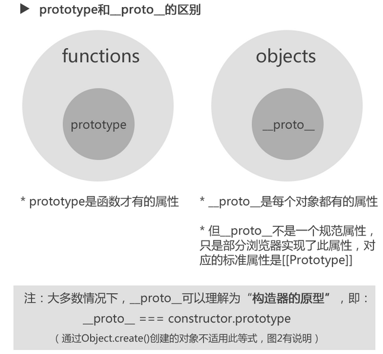
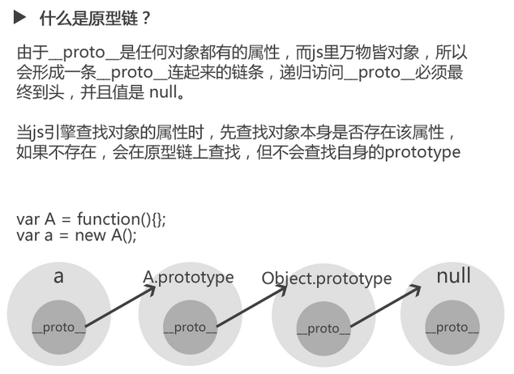

## JS知识点

### 1.  call、apply以及blind的区别？

* 这几个方法分别是：Function.prototype.call(), Function.prototype.apply(), 以及Function.prototype.blind()

* call调用方法并且参数的类型可以是多个

* apply调用方法并且参数的类型为数组

* blind返回一个新的函数，并且参数类型没有限制

* call demo：

  ```javascript
  var person1 = {firstName: 'Jon', lastName: 'Kuperman'};
  var person2 = {firstName: 'Kelly', lastName: 'King'};
  function say(greeting) {
      console.log(greeting + ' ' + this.firstName + ' ' + this.lastName);
  }
  say.call(person1, 'Hello'); // Hello Jon Kuperman
  say.call(person2, 'Hello'); // Hello Kelly King
  ```

* apply demo:

  ```javascript
  var person1 = {firstName: 'Jon', lastName: 'Kuperman'};
  var person2 = {firstName: 'Kelly', lastName: 'King'};
   
  function say(greeting) {
      console.log(greeting + ' ' + this.firstName + ' ' + this.lastName);
  }
   
  say.apply(person1, ['Hello']); // Hello Jon Kuperman
  say.apply(person2, ['Hello']); // Hello Kelly King
  ```

* blind demo:

  ```javascript
  var person1 = {firstName: 'Jon', lastName: 'Kuperman'};
  var person2 = {firstName: 'Kelly', lastName: 'King'};
   
  function say() {
      console.log('Hello ' + this.firstName + ' ' + this.lastName);
  }
   
  var sayHelloJon = say.bind(person1);
  var sayHelloKelly = say.bind(person2);
   
  sayHelloJon(); // Hello Jon Kuperman
  sayHelloKelly(); // Hello Kelly King
  ```


### 2. 继承

* 继承在ES6之前可以通过原型链的方式，在ES6的时候可以通过extends关键字实现继承。

* 在ES5的时候js利用的是原型链的特性来实现继承。在ES6中，封装了class，extends关键字来实现继承。

* 代码如下所示：

  ```javascript
  //先来个父类，带些属性
  function Super(){
      this.flag = true;
  }
  //为了提高复用性，方法绑定在父类原型属性上
  Super.prototype.getFlag = function(){
      return this.flag;
  }
  //来个子类
  function Sub(){
      this.subFlag = false;
  }
  //实现继承
  Sub.prototype = new Super;
  //给子类添加子类特有的方法，注意顺序要在继承之后
  Sub.prototype.getSubFlag = function(){
      return this.subFlag;
  }
  //构造实例
  var es5 = new Sub; 
  ```

  ```javascript
  class ColorPoint extends Point {
    constructor(x, y, color) {
      super(x, y); // 等同于parent.constructor(x, y)
      this.color = color;
    }
    toString() {
      return this.color + ' ' + super.toString(); // 等同于parent.toString()
    }
  } 
  ```

### 3. 原型链

* 什么是原型链？

  * 原型链作为实现继承的主要方法，用于JS中的实现继承。

* prototype和_proto_的区别

  

  

  ​