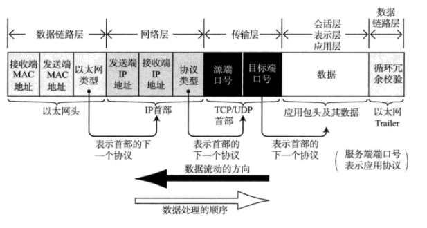

## 1. TCP/IP的标准化

### 1.1 TCP/IP协议群

* TCP/IP一词泛指一系列协议，因此也有时候称TCP/IP为网际协议族。包括以下协议：
  * 应用协议
    * HTTP、SMTP、FTP、TELNET、SNMP
  * 路由控制协议
    * RIP、OSPF、BGP
  * 网际协议
    * IP、ICMP、ARP
  * 传输协议
    * TCP、UDP

## 2. TCP/IP分层模型与通信示例

### 2.1 包、帧、数据报、段、消息

* 以上五个描述词都用来表述数据单位，大致区分如下：
  * 包：是全能性术语。
  * 帧：用来表示数据链路层中包的单位
  * 数据：是IP和UDP等网络层以上的分层中的单位。
  * 段：表示TCP数据流中的信息
  * 消息：是指应用协议中数据的单位

### 2.2 包首部

* 网络中传输的数据包由两部分组成

  * 一部分是协议要用到的首部
  * 另一部分是上层传递过来的数据

* 在数据包的首部，明确标明了协议应该如何读取数据。（包首部就想协议的脸，看到首部，就能够了解该协议必要的信息以及所需要处理的内容）

* 每个包首部也至少包含两个信息：一个是发送端和接收端地址，另一个是上一层的协议类型。

* 包的结构如下所示：

  

### 2.3 数据包接收处理

* 包的接收流程是发送流程的逆序过程
* **网络接口**(以太网中网络数据连接的端口就是以太网接口)的处理
  * 主机收到以太网包以后，首先从以太网的包首部找到MAC地址，判断是否是发给自己的包，如果不是则丢弃数据。
  * 如果是发给自己的包，就查找以太网包首部中的类型域从而确定以太网协议传递过来的数据类型，如果以太网包首部类型域包含一个无法识别的协议类型，则丢弃数据。
* **IP**模块的处理
  * IP模块接收到IP包的首部和数据部分后，先判断包首部的IP地址和自己的IP地址是否匹配，如果匹配，则可接收数据并从中查找上一层的协议，如果上一层是TCP(UDP)，则将IP包首部之后的数据传给TCP(UDP)处理,对于有路由的情况下，接受端往往不是自己的地址，此时，需要借助路由控制表，在调查应该送达的主机或路由以后再转发数据。
* TCP模块处理
  * 在TCP模块中，首先会计算一下校验和，判断数据是否破坏。然后检查是否按序号接收数据。最后检查端口号，确定具体的应用程序。
  * 在接受完毕之后，接收端会发送一个’确认回执‘给发送端。如果这个回执信息未能到达发送端，那么发送端会认为接受端没有接收到数据而一直反复发送。
  * 数据完整接收后，会传给段就好识别的应用程序。
* 应用程序处理
  * 接收端应用程序会直接接收发送端发送的数据。通过解析数据可以获知邮件的收件人地址。

